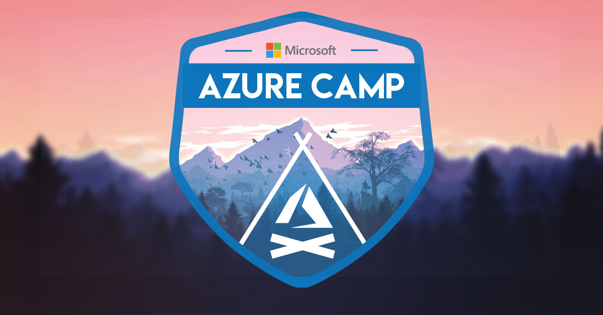

# Wprowadzenie

### Na dobry początek

Przez najbliższe 2 godziny poznasz rozwiązania, które zmienią sposób w jaki myślisz o chmurze. 

* Zaczniemy od aktywacji Twojego prezentu od firmy Microsoft, **50$ **dostępnych na potrzeby Microsoft Azure,
* Kolejnym krokiem będzie nauka portalu Azure - miejsca, w którym zarządzasz wszystkimi usługami swojej chmury. Oprócz portalu, pokażemy także pokrótce na czym polega _Azure Cloud Shell,_
* Następnie dowiemy się jakie możliwości oferują maszyny wirtualne, na których przygotujemy swoje ulubione środowisko developerskie,
* Stworzymy także aplikację webową w wybranej technologii i przekonamy się jakie możliwości oferuje dla nich chmura,
* W planach mamy także małe zadania związane z Logic Apps - pokażemy jak łatwo automatyzować flow dowolnego procesu \(jak chociażby obsługa ciekawych maili\).

W Twojej sali znajduje się mentor, który poprowadzi Cię przez wszystkie te zadania. Nie bój się zadawać pytań - małe grupy laboratoryjne pomogą nam utrzymać kameralną atmosferę!

Powodzenia!

